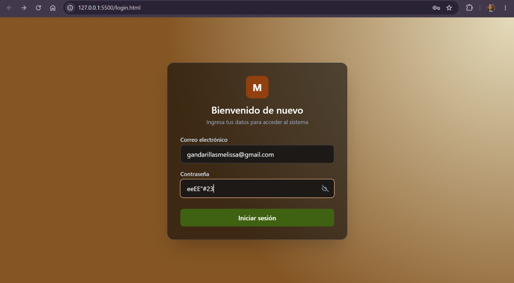
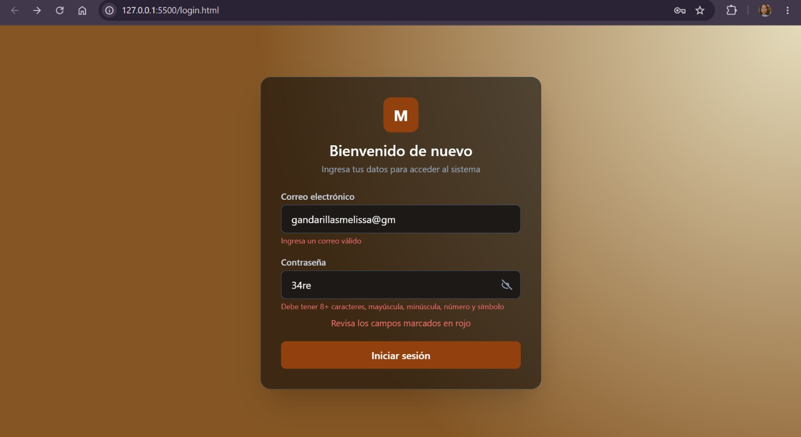
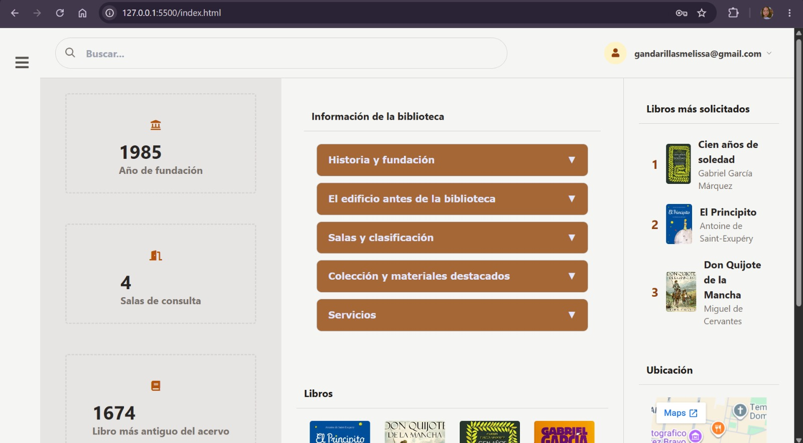
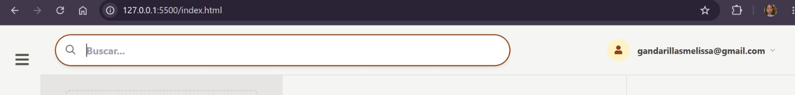
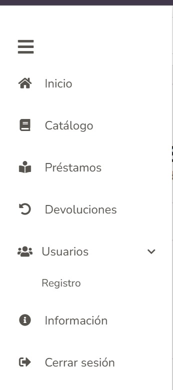
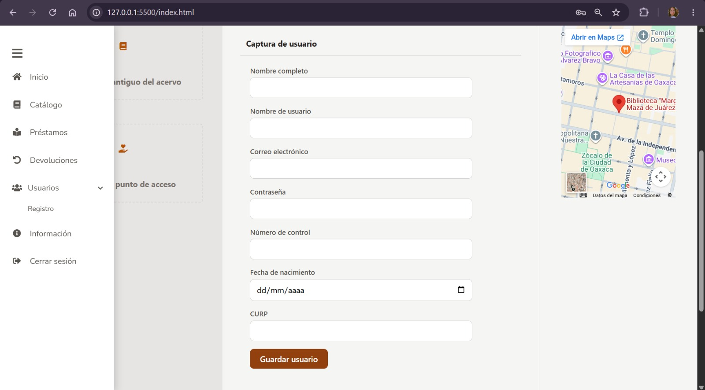
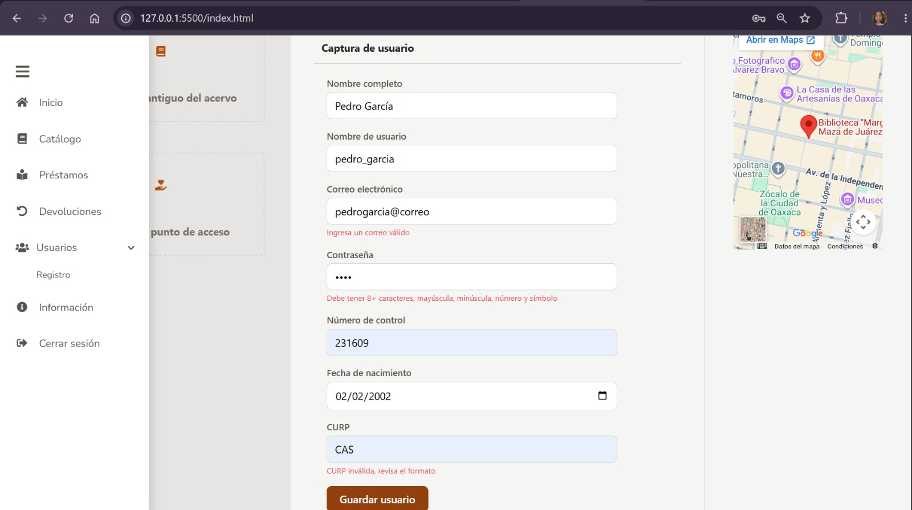
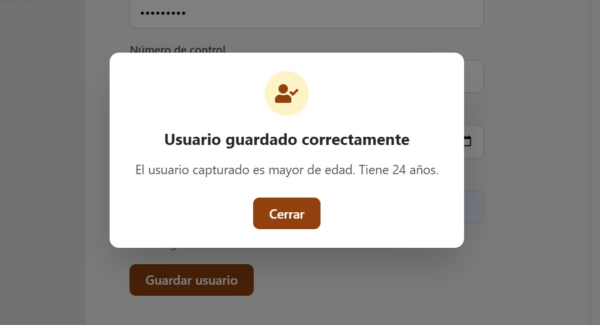

# Sistema de Biblioteca Digital con Login

<div align="center">

## Tecnológico Nacional de México

### Instituto Tecnológico de Oaxaca

**Materia:** Programación Web

### Proyecto: Sistema de Biblioteca Digital con Login

**Integrantes del EQUIPO 2:**

* Dalia Montserrat Caballero Silva
* Gandarillas Melissa

</div>

---

## Descripción del proyecto

Este proyecto consiste en el desarrollo de un sistema web de biblioteca digital con un flujo de acceso simulado mediante un formulario de inicio de sesión.

El sistema está formado por dos pantallas principales:

* `login.html`: permite al usuario ingresar un correo electrónico y una contraseña. Los datos son validados con funciones de JavaScript y, cuando cumplen con los requisitos, el usuario es redirigido al sistema principal.
* `index.html`: representa la pantalla principal del sistema una vez iniciada la sesión. Contiene un sidebar, una barra de navegación superior, información de la biblioteca, un formulario de captura de usuarios, validaciones y un modal de edad.

El proyecto fue desarrollado utilizando HTML, CSS, JavaScript y Tailwind CSS.

---

## Objetivo

Crear un login funcional utilizando HTML, CSS y JavaScript que simule el acceso a un sistema web.

Además, se integraron diferentes funcionalidades dentro de la pantalla principal, entre ellas:

* Validación del correo electrónico.
* Validación de contraseña.
* Almacenamiento temporal del usuario que inició sesión.
* Visualización del correo del usuario en el navbar.
* Menú lateral desplegable.
* Formulario para registrar usuarios.
* Validación del nombre completo.
* Validación del nombre de usuario.
* Validación del correo electrónico.
* Validación de contraseña.
* Validación del número de control.
* Validación de fecha de nacimiento.
* Cálculo de edad.
* Validación de CURP.
* Modal informativo de edad.
* Cierre de sesión.
* Acordeón informativo.
* Buscador de información.
* Visualización de libros y datos de la biblioteca.

---

## Tecnologías utilizadas

El proyecto utiliza las siguientes tecnologías:

* **HTML5:** para la estructura de las páginas.
* **CSS3:** para estilos personalizados.
* **JavaScript:** para validaciones, eventos, almacenamiento de sesión y comportamiento dinámico.
* **Tailwind CSS:** framework CSS utilizado como base para el diseño visual.
* **Font Awesome:** utilizado para algunos iconos de la interfaz.
* **Session Storage:** utilizado para conservar temporalmente los datos del usuario durante la sesión.
* **Google Maps Embed:** utilizado para mostrar la ubicación de la biblioteca.

---

## Framework CSS

El framework utilizado en el proyecto es **Tailwind CSS**.

Tailwind CSS se carga mediante CDN en las páginas HTML y se complementa con archivos CSS propios para personalizar diferentes partes del sistema.

No se utilizaron frameworks de JavaScript como React o Vue.

---

## Plantilla utilizada para `index.html`

Para la estructura inicial de la pantalla principal se utilizó la siguiente plantilla:

[Minimal Admin Template - Tailwind Toolbox](https://github.com/tailwindtoolbox/Minimal-Admin-Template)

La plantilla original presentaba la estructura principal del dashboard concentrada en un archivo HTML, junto con los elementos necesarios para su diseño y comportamiento.

Para adaptarla al proyecto se realizó una reorganización del código, separando responsabilidades en diferentes archivos:

* El HTML se mantuvo en `index.html`.
* Los estilos personalizados se organizaron dentro de la carpeta `css`.
* La funcionalidad JavaScript se organizó dentro de la carpeta `js`.
* Las funciones reutilizables de validación se concentraron en `utileria.js`.

Esta separación permitió tener una estructura más organizada y facilitar la lectura, mantenimiento y reutilización del código.

La plantilla también fue modificada visual y funcionalmente para convertir el dashboard administrativo original en un sistema relacionado con una biblioteca digital.

Entre las principales adaptaciones se encuentran:

* Cambio del contenido original por información de una biblioteca.
* Modificación de colores y estilos.
* Creación del menú de usuarios.
* Implementación de un formulario de registro.
* Integración de las funciones de `utileria.js`.
* Visualización del usuario activo en el navbar.
* Implementación del cierre de sesión.
* Incorporación de libros.
* Incorporación de información de la biblioteca mediante un acordeón.
* Integración de un mapa de ubicación.
* Creación de un modal para mostrar información relacionada con la edad del usuario.

---

# Flujo del sistema

## 1. Inicio de sesión

El flujo comienza en:

```text
login.html
```

El usuario debe capturar:

* Correo electrónico.
* Contraseña.

El correo se valida mediante la función:

```javascript
validarCorreo()
```

La contraseña se valida mediante:

```javascript
validarPassword()
```

El proyecto simula el acceso al sistema, por lo que no utiliza una base de datos ni un servidor backend para comprobar usuarios registrados.

Cuando los datos cumplen con las validaciones, el correo se guarda temporalmente mediante:

```javascript
sessionStorage.setItem("usuarioActivo", correo);
```

Después se realiza la redirección:

```javascript
window.location.href = "index.html";
```

Por lo tanto, el flujo es:

```text
login.html
     |
     | Datos válidos
     v
index.html
```

---

## 2. Paso del usuario del login al navbar

Para pasar el usuario desde el login hasta la pantalla principal se utiliza `sessionStorage`.

En el login se guarda el correo:

```javascript
sessionStorage.setItem("usuarioActivo", correo);
```

En `index.html`, el archivo `script.js` recupera la información:

```javascript
let usuarioActivo = sessionStorage.getItem("usuarioActivo");
```

Posteriormente, el valor recuperado se muestra en el navbar:

```javascript
document.getElementById("nombreUsuarioNavbar").textContent = usuarioActivo;
```

De esta manera, el correo capturado en el login aparece en la parte superior de la pantalla principal.

Además, si se intenta entrar directamente a `index.html` sin haber iniciado sesión, el sistema realiza una redirección hacia:

```text
login.html
```

---

## 3. Cierre de sesión

El sistema cuenta con opciones para cerrar sesión.

Cuando el usuario selecciona **Cerrar sesión**, se elimina el valor almacenado:

```javascript
sessionStorage.removeItem("usuarioActivo");
```

Después, el usuario regresa a:

```text
login.html
```

Con esto se simula el cierre de una sesión dentro del sistema.

---

# Funcionalidades de `index.html`

## Sidebar

La pantalla principal cuenta con un menú lateral o sidebar.

El menú contiene opciones relacionadas con el sistema de biblioteca, por ejemplo:

* Inicio.
* Catálogo.
* Préstamos.
* Devoluciones.
* Usuarios.
* Información.
* Cerrar sesión.

El sidebar cuenta con un botón hamburguesa que permite abrirlo o cerrarlo.

El comportamiento se realiza mediante JavaScript agregando o quitando una clase CSS:

```javascript
sidebar.classList.toggle("menu-abierto");
```

---

## Menú Usuarios

Dentro del sidebar se agregó la opción:

```text
Usuarios
```

Al seleccionarla se muestra un submenú con la opción:

```text
Registro
```

El formulario de captura permanece oculto inicialmente.

Únicamente aparece cuando el usuario selecciona:

```text
Usuarios → Registro
```

Esto evita que el formulario se muestre permanentemente dentro de la página.

---

## Formulario de registro de usuarios

El formulario permite capturar los siguientes datos:

* Nombre completo.
* Nombre de usuario.
* Correo electrónico.
* Contraseña.
* Número de control.
* Fecha de nacimiento.
* CURP.

Antes de guardar un usuario, todos los campos son validados.

Cuando existe algún error, se muestra un mensaje debajo del campo correspondiente.

El usuario solamente puede registrarse cuando todos los datos cumplen con las condiciones establecidas.

---

# Métodos principales

Las funciones de validación reutilizables se encuentran en:

```text
js/utileria.js
```

## `validarCorreo(correo)`

Valida que una cadena tenga la estructura básica de un correo electrónico.

Ejemplo de formato válido:

```text
usuario@correo.com
```

---

## `validarPassword(password)`

Comprueba que una contraseña tenga:

* Mínimo 8 caracteres.
* Una letra mayúscula.
* Una letra minúscula.
* Un número.
* Un carácter especial.

La validación se utiliza tanto en el login como en el formulario de registro.

---

## `soloLetras(texto)`

Comprueba que el nombre completo contenga únicamente:

* Letras.
* Espacios.
* Vocales acentuadas.
* Letra ñ.
* Diéresis.

Se utiliza en el campo de nombre completo.

---

## `validarNombreUsuario(usuario)`

Valida que el nombre de usuario esté formado por:

* Letras.
* Números.
* Guion bajo.

---

## `validarNumControl(control)`

Comprueba que el número de control contenga exactamente seis dígitos.

La expresión utilizada es:

```javascript
/^\d{6}$/
```

Ejemplo válido:

```text
123456
```

Ejemplos inválidos:

```text
12345
1234567
ABC123
```

---

## `calcularEdad(fechaNacimiento)`

Calcula la edad de una persona tomando como referencia su fecha de nacimiento y la fecha actual.

La función también permite detectar:

* Fechas futuras.
* Fechas incorrectas.
* Usuarios menores de edad.

El formulario de registro solamente permite continuar cuando la persona tiene 18 años o más.

---

## `esMayorDeEdad(fechaNacimiento)`

Utiliza el resultado de `calcularEdad()` para determinar si una persona tiene 18 años o más.

---

## `validarCurp(curp)`

Comprueba el formato general de una CURP.

Además, obtiene la parte correspondiente a la fecha de nacimiento y utiliza:

```javascript
calcularEdad()
```

para comprobar que la fecha obtenida no sea futura o inválida.

---

# Modal de edad

Cuando todos los datos del formulario son válidos y el usuario cumple con la edad requerida, se muestra un modal informativo.

El modal indica la edad calculada del usuario.

Ejemplo:

```text
El usuario capturado es mayor de edad. Tiene 20 años.
```

El formulario permanece visible mientras el modal está abierto.

Cuando se presiona el botón **Cerrar**:

1. El modal desaparece.
2. El formulario se limpia.
3. La sección de captura se vuelve a ocultar.
4. Para registrar otro usuario es necesario volver a seleccionar `Usuarios → Registro`.

---

# Acordeón informativo

La página principal incluye un acordeón con información de la biblioteca.

La funcionalidad se encuentra en:

```text
js/acordeon.js
```

Entre sus métodos principales se encuentran:

```javascript
crearAcordeon()
crearSeccion()
crearEncabezado()
crearPanel()
abrirSeccion()
cerrarSeccion()
cerrarTodasLasSecciones()
manejarClicEnSeccion()
```

El acordeón permite organizar información en diferentes apartados desplegables.

---

# Buscador

La barra de búsqueda permite filtrar las secciones del acordeón.

El texto ingresado se normaliza mediante:

```javascript
normalizarTexto()
```

Después se realiza el filtrado con:

```javascript
filtrarAcordeonBiblioteca()
```

La búsqueda ignora diferencias entre mayúsculas, minúsculas y acentos.

---

# Proceso de creación

## Paso 1. Creación de la estructura del proyecto

Se organizó el proyecto utilizando dos páginas principales:

```text
login.html
index.html
```

También se crearon carpetas para separar los estilos, scripts e imágenes.

---

## Paso 2. Creación del login

Se creó una pantalla de inicio de sesión con los campos:

* Correo electrónico.
* Contraseña.

Posteriormente se agregaron mensajes de error para los datos que no cumplen con las validaciones.

También se agregó un botón para mostrar y ocultar la contraseña.

---

## Paso 3. Integración de `utileria.js`

Se incorporaron las funciones de la librería:

```text
utileria.js
```

Las funciones se reutilizaron para evitar repetir código de validación.

Por ejemplo, `validarCorreo()` y `validarPassword()` se utilizan en diferentes formularios del proyecto.

---

## Paso 4. Simulación del inicio de sesión

Se agregó un evento al formulario del login para evitar el envío tradicional.

Posteriormente:

1. Se obtienen los valores capturados.
2. Se validan los datos.
3. Se guarda el correo en `sessionStorage`.
4. Se redirige a `index.html`.

---

## Paso 5. Adaptación de la plantilla

Se tomó como base la plantilla Minimal Admin Template de Tailwind Toolbox:

https://github.com/tailwindtoolbox/Minimal-Admin-Template

La plantilla fue adaptada para convertirla en un sistema de biblioteca digital.

Además, se reorganizó el código original para separar:

```text
HTML
CSS
JavaScript
```

El código HTML quedó en las páginas correspondientes, los estilos personalizados se colocaron en la carpeta `css` y la lógica se colocó en la carpeta `js`.

---

## Paso 6. Modificación del sidebar

Se adaptaron las opciones del menú lateral al tema de biblioteca.

También se agregó:

```text
Usuarios
    └── Registro
```

El formulario se configuró para permanecer oculto hasta seleccionar la opción Registro.

---

## Paso 7. Creación del navbar con usuario activo

Se recuperó el correo almacenado en `sessionStorage` y se mostró en la barra superior.

También se creó un menú desplegable con la opción de cerrar sesión.

---

## Paso 8. Creación del formulario de usuarios

Se creó un formulario para registrar datos del usuario.

Se agregaron campos para:

```text
Nombre completo
Nombre de usuario
Correo electrónico
Contraseña
Número de control
Fecha de nacimiento
CURP
```

---

## Paso 9. Validación del número de control

Se agregó la función:

```javascript
validarNumControl()
```

La función permite únicamente valores que tengan exactamente seis dígitos.

---

## Paso 10. Validación de edad

Se utilizó:

```javascript
calcularEdad()
```

para determinar la edad del usuario.

También se estableció como fecha máxima seleccionable la fecha actual, evitando seleccionar desde el calendario una fecha posterior.

El sistema no permite registrar usuarios menores de 18 años.

---

## Paso 11. Creación del modal

Después de completar correctamente el registro, se muestra un modal con la edad calculada.

Al cerrar el modal:

* Se limpia el formulario.
* Se oculta la sección de registro.
* El usuario debe abrir nuevamente `Usuarios → Registro` para realizar una nueva captura.

---

## Paso 12. Incorporación de contenido de la biblioteca

La plantilla fue personalizada agregando:

* Datos generales de la biblioteca.
* Libros.
* Libros más solicitados.
* Información histórica.
* Servicios.
* Acordeón informativo.
* Buscador.
* Mapa de ubicación.

---

## Paso 13. Pruebas del flujo completo

Se verificó el siguiente flujo:

```text
Abrir login.html
        |
        v
Capturar correo y contraseña
        |
        v
Validar los datos
        |
        v
Guardar usuario en sessionStorage
        |
        v
Redirigir a index.html
        |
        v
Mostrar usuario en navbar
        |
        v
Abrir Usuarios → Registro
        |
        v
Capturar y validar datos
        |
        v
Mostrar modal
        |
        v
Cerrar modal
        |
        v
Ocultar y limpiar formulario
        |
        v
Cerrar sesión
        |
        v
Regresar a login.html
```

---

# Estructura del proyecto

```text
ProyectoLogin/
│
├── README.md
├── login.html
├── index.html
│
├── css/
│   ├── acordeon.css
│   ├── login.css
│   └── styles.css
│
├── js/
│   ├── acordeon.js
│   ├── login.js
│   ├── script.js
│   └── utileria.js
│
└── img/
    ├── Libro1.webp
    ├── Libro2.jpg
    ├── Libro3.jpg
    └── Libro4.jpg
```

---

# Cómo ejecutar el proyecto

Para ejecutar el sistema de manera local:

1. Descargar o clonar el repositorio.
2. Abrir la carpeta del proyecto en Visual Studio Code.
3. Abrir `login.html` utilizando un navegador o una extensión como Live Server.
4. Capturar un correo y contraseña que cumplan con las validaciones.
5. Presionar **Iniciar sesión**.
6. Probar las opciones disponibles dentro de `index.html`.
7. Cerrar sesión para comprobar el regreso a `login.html`.

---

# Capturas de pantalla

> Las siguientes imágenes deben agregarse a la carpeta `img` con los nombres indicados para que aparezcan correctamente en el README.

## Pantalla de inicio de sesión

```markdown

```

---

## Validaciones del login

```markdown

```

---

## Pantalla principal del sistema

```markdown

```

---

## Navbar mostrando el usuario activo

```markdown

```

---

## Menú Usuarios y opción Registro

```markdown

```

---

## Formulario de captura

```markdown

```

---

## Validación de datos

```markdown

```

---

## Modal de edad

```markdown

```

---

# Repositorio

[Repositorio del proyecto en GitHub](https://github.com/MontseCaballero29/ProyectoLogin)

---

# GitHub Pages

[Enlace de GitHub Pages](https://montsecaballero29.github.io/ProyectoLogin/)

---

# Conclusión

El desarrollo de este proyecto permitió integrar conocimientos de HTML, CSS y JavaScript en un sistema web compuesto por varias pantallas conectadas.

Se implementó un flujo completo desde el inicio de sesión hasta el cierre de sesión, utilizando `sessionStorage` para conservar temporalmente los datos del usuario.

También se integraron funciones reutilizables de validación, un sidebar interactivo, un navbar dinámico, un formulario de registro, validación del número de control, cálculo de edad, validación de CURP y un modal informativo.

Finalmente, la adaptación y reorganización de la plantilla permitió aplicar una separación más clara entre HTML, CSS y JavaScript, facilitando la organización y mantenimiento del proyecto.
